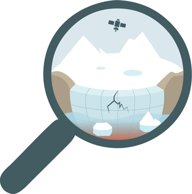

::: {.hero}
::: {.hero-panel}
::: {.hero-logo}
{fig-alt="IceDaM logo: a magnifying glass over a fractured ice shelf, with a satellite overhead"}
:::
::: {.hero-text}
[ERC Starting Grant]{.badge-erc}

# IceDaM

::: {.tagline}
Ice Shelf Damage Characterization and Monitoring around Antarctica
:::

::: {.lead}
The ice shelves of Antarctica act as giant dams limiting ice flow from the interior into the ocean. Several of these dams have recently shown dramatic signs of damage. IceDaM aims to quantify and understand the evolution of damage on ice shelves around Antarctica, combining satellite imagery, deep learning and ice flow modelling.
:::

[About the project](project.qmd){.btn-ice} [Meet the team](team.qmd){.btn-ice .alt}
:::
:::
:::

## Objectives

::: {.objectives}
::: {.objective}
[Objective 1]{.num}

### Observing

Observing fracturing spatio-temporal variability from space and its impact on ice shelf buttressing.
:::
::: {.objective}
[Objective 2]{.num}

### Understanding

Understanding processes creating and enhancing ice shelf damage.
:::
::: {.objective}
[Objective 3]{.num}

### Monitoring

Using damage as a sentinel for ice shelf vulnerability.
:::
:::

## Why it matters

Once the ice is fracturing, the dam is weakened, allowing the ice to flow faster and increasing mass loss from the interior of the ice sheet, which results in an accelerated contribution to sea level. Damage is currently absent from projections of the evolution of Antarctica. [Read more →](project.qmd)
